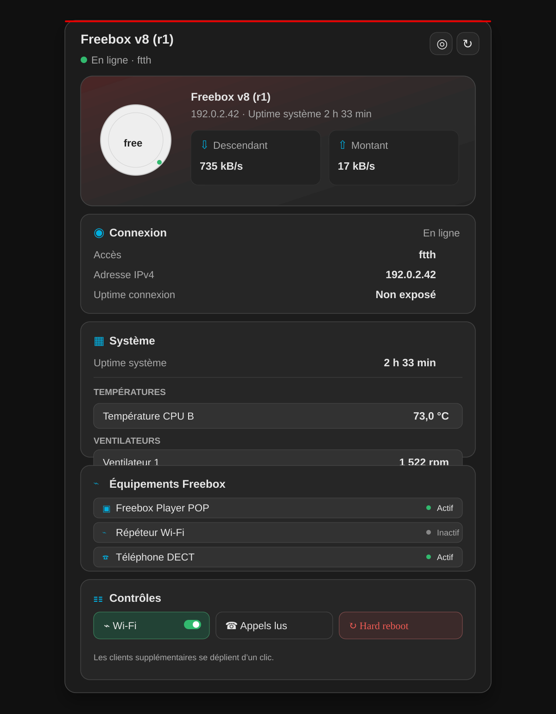

<p align="center">
  
</p>

# Freebox Pop Card

A modern Home Assistant dashboard card for the **Freebox Pop Server**. It uses the entities created by
Home Assistant's official [`freebox`](https://www.home-assistant.io/integrations/freebox/) integration
and does not connect to the router directly from the browser.

[](https://github.com/Minims/freebox-pop-card/actions/workflows/validate.yml)
[](https://github.com/Minims/freebox-pop-card/releases/latest)
[](LICENSE)
[](https://www.buymeacoffee.com/minims)

<p align="center">
  <a href="https://my.home-assistant.io/redirect/hacs_repository/?owner=Minims&repository=freebox-pop-card&category=plugin">
    
  </a>
</p>

## Preview

<p align="center">
  
</p>

## Features

- Automatic Freebox Server and entity discovery by Home Assistant `device_id`; renamed entity IDs work.
- Live upload and download rates using Home Assistant's localized unit formatting.
- WAN details: IPv4, IPv6, access type, and connection uptime when exposed.
- Separate system uptime display, without confusing it with the Internet connection uptime.
- Temperatures, fan speeds, attached storage, RAID health, missed calls, and an expandable
  connected-client list.
- Player, Wi-Fi repeater, and DECT-phone online state when detected through Freebox device trackers.
- Wi-Fi control, Freebox OS shortcut, mark-calls-read action, protected Server reboot, and optional
  hardware power cycle through a Zigbee plug.
- Compact, overview, and detailed layouts for Sections dashboards and mobile screens.
- English and French interface, Home Assistant theme support, and a visual card editor.
- Capability-driven rendering: unavailable sections are omitted instead of showing broken controls.

The card only uses Home Assistant state, entity-registry, and device-registry data. Authentication and
Freebox API traffic remain entirely inside the official integration.

## Requirements

- A Freebox Pop Server configured with Home Assistant's official
  [Freebox integration](https://www.home-assistant.io/integrations/freebox/).
- A current Home Assistant release and HACS with Dashboard repositories enabled.
- The **Modification des réglages de la Freebox** permission granted to Home Assistant in Freebox OS
  if Wi-Fi control or reboot is required.

The card is designed for the Pop V8 but remains capability-compatible with other Freebox OS routers
supported by the official integration.

## Installation

### HACS

1. Select the **Open in HACS** badge above, or add `https://github.com/Minims/freebox-pop-card` as a
   custom **Dashboard** repository in HACS.
2. Install **Freebox Pop Card**.
3. Reload the browser when HACS requests it, then add the card from the dashboard editor.

HACS normally registers the JavaScript resource automatically. If needed, add
`/hacsfiles/freebox-pop-card/freebox-pop-card.js` as a JavaScript module under
**Settings → Dashboards → Resources**.

### Manual

Download `freebox-pop-card.js` from the latest GitHub release into `config/www/`, then register
`/local/freebox-pop-card.js` as a JavaScript module.

## Configuration

The visual editor discovers compatible Freebox Server devices. If exactly one is configured, the card
selects it automatically.

```yaml
type: custom:freebox-pop-card
device_id: 0123456789abcdef0123456789abcdef
title: Freebox Pop
view: overview # compact, overview, or detailed
show_connection: true
show_system: true
show_storage: true
show_clients: true
show_controls: true
confirm_actions: true
max_clients: 6
show_equipment: true
hard_reboot_entity: switch.freebox_power # optional Zigbee plug supplying the Server
hard_reboot_delay: 15 # seconds, from 5 to 300
```

| Option               | Default     | Description                                                     |
| -------------------- | ----------- | --------------------------------------------------------------- |
| `device_id`          | automatic   | Home Assistant device-registry ID; required with several boxes. |
| `title`              | device name | Optional card title.                                            |
| `view`               | `overview`  | `compact`, `overview`, or single-column `detailed`.             |
| `show_connection`    | `true`      | Shows WAN addresses, access type, and connection uptime.        |
| `show_system`        | `true`      | Shows temperatures, fans, and missed calls.                     |
| `show_storage`       | `true`      | Shows attached partitions and RAID health.                      |
| `show_clients`       | `true`      | Shows devices currently connected to this Freebox.              |
| `show_equipment`     | `true`      | Shows detected Player, Wi-Fi repeater, and DECT-phone state.    |
| `show_controls`      | `true`      | Shows Wi-Fi, Freebox OS, call, and reboot actions.              |
| `confirm_actions`    | `true`      | Confirms Wi-Fi shutdown and Server reboot.                      |
| `max_clients`        | `6`         | Number of connected clients displayed, from 0 to 20.            |
| `hard_reboot_entity` | empty       | Optional `switch` entity for the Freebox power plug.            |
| `hard_reboot_delay`  | `15`        | Plug off-duration, in seconds; clamped between 5 and 300.       |

## Current Freebox integration limits

The official integration does not currently expose individual Ethernet-port link state, negotiated
speed, duplex, or per-port traffic. The card therefore does not invent or scrape those values. If Home
Assistant adds entities for them in the future, they can be incorporated without moving Freebox
authentication into the frontend.

The integration currently exposes the Server boot time as `uptime`, which the card labels **System
uptime**. A separate **Connection uptime** row is kept distinct and reports that it is not exposed until
Home Assistant provides that value.

Connected-client detection depends on the `device_tracker` entities created by the official Freebox
integration. Disabled entities are not displayed. The Player, repeater, and phone panel is populated
only when those trackers are identifiable from their Freebox metadata, icon, or label.

## Optional hard reboot

Set `hard_reboot_entity` to the **switch entity of the Zigbee plug that powers the Freebox Server**.
The hard-reboot button is available to Home Assistant administrators only, asks for confirmation, and
sends the complete off → wait → on sequence to Home Assistant. This means the plug is restored even if
the browser loses access while the Freebox is powered off. Use a dedicated plug and do not enable this
option for a shared power strip.

## Development

Node.js 20.19 or newer is required.

```bash
npm ci
npm test
npm run lint
npm run build
npm run check
```

Source files live under `src/`. The HACS bundle is generated at
`dist/freebox-pop-card.js`; do not edit it manually.

## Privacy and safety

Do not include public IP addresses, serial numbers, MAC addresses, or unredacted Home Assistant
diagnostics in issues or screenshots. Wi-Fi shutdown, reboot, and hard reboot can interrupt access to
Home Assistant; confirmations are enabled by default.

Freebox and Free are trademarks of their respective owner. This independent project is not affiliated
with or endorsed by Free.
